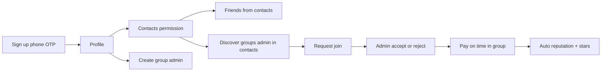

# User Flow — Kameeti – Tradition Meets Tech

High-level journey aligned with [FEATURES_SPEC.md](./FEATURES_SPEC.md).

## 1. Sign up & identity

1. User opens the app → **Sign up** with **phone number** (E.164 normalized, e.g. +92…).
2. **OTP** (SMS or WhatsApp-style verification) proves ownership; account is **unique by phone** (one account per number).
3. User sets **profile** (display name, optional photo).
4. User can open **Profile** anytime to view/edit.
5. **Trust & reputation** (background): as the user pays on time and completes cycles, the system **automatically** updates **points, stars, and badges** ([REPUTATION_AND_GAMIFICATION.md](./REPUTATION_AND_GAMIFICATION.md)); others may see summary stars on **Friends** and when **requesting to join**.

## 2. Contacts permission & “friends” (WhatsApp-like)

1. App requests **read contacts** permission (OS dialog).
2. User can **search / browse people on the platform** who appear in **their phone’s contact list** — i.e. intersection of **device contacts** × **registered users**, matched by **normalized phone number**.
3. Only users **already signed up** and **present in contacts** surface in this list (not random global search by default).

## 3. Create a kameeti group

1. Authenticated user creates a **kameeti group** (name, rules: installment, period, Method 1 / 2, etc.).
2. User is **admin (organizer)** of that group.
3. Admin can add members from **friends** list or by phone (policy per product).

## 4. Discover groups (admin in your contacts)

1. User opens **Discover groups** (or search).
2. System shows **kameeti groups** whose **admin’s phone number** is in the user’s **mobile contact list** and that admin is a **registered user**.
3. User can open a group card and **request to join**.

## 5. Join request & admin approval

1. **Request to join** creates a **pending** request for that group’s admin.
2. **Admin** sees incoming requests (notification or inbox), including **requester’s star / trust summary** to support decisions.
3. Admin **Accept** → user becomes a **member** of the group (ledger row created per [kameeti-system.md](../kameeti-system.md) rules).
4. Admin **Reject** → request closes; user may be notified.

## Summary diagram

---

*Implementation details: [DATA_MODEL.md](./DATA_MODEL.md), [SCREENS_AND_NAVIGATION.md](./SCREENS_AND_NAVIGATION.md).*
